```{r}
# Paquetes
library(dplyr)
library(stringr)
library(gt)
```

### 📲 Accede a las diapositivas en línea

[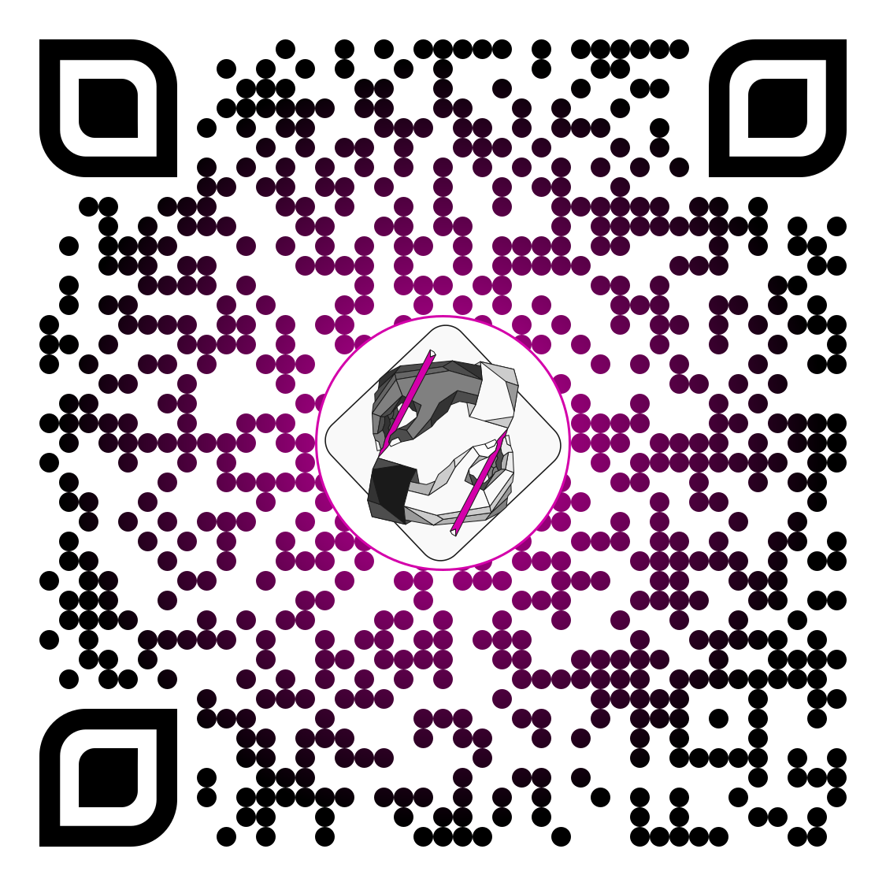{fig-align="center" width="45%"}](https://jdleongomez.github.io/Presentacion_MetaCiencia/)

::: {.aside .center}
{width="22" style="vertical-align:middle; margin-right:.35em;"}Materiales (incluyendo imágenes y código de R) disponibles en [GitHub](https://github.com/JDLeongomez/Presentacion_MetaCiencia)
:::

# [Parte 1 · Los desafíos para la credibilidad científica]{.is-accent auto-animate="true"}

---

## 1.1 ¿Por qué es tan difícil generar conocimiento confiable? {auto-animate="true"}

¿Cómo se crea conocimiento?

::: {.fragment .fade-in style="margin-top: 30px; font-size: 0.8em; color: #d400aa;"}
¿Si mi gato hace más pataletas, sueño más con empanadas?
:::

---

## 1.1 ¿Por qué es tan difícil generar conocimiento confiable? {auto-animate="true"}

::: {style="font-size: 0.8em; color: #d400aa;"}
¿Si mi gato hace más pataletas, sueño más con empanadas?
:::

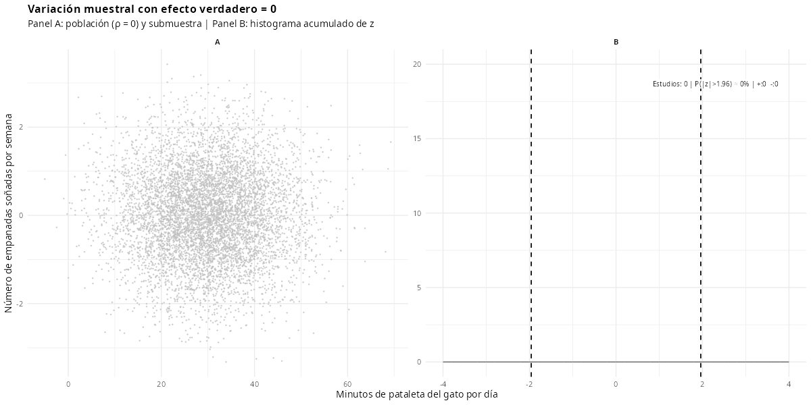

[Ver script de R: falsos positivos](https://github.com/JDLeongomez/Presentacion_MetaCiencia/blob/master/r_scripts/falsos_positivos_simulacion.R){.is-accent style="font-size: 40%;"}

---

## 1.1 ¿Por qué es tan difícil generar conocimiento confiable? {auto-animate="true"}

::: {style="font-size: 0.8em; color: #d400aa;"}
¿Si mi gato hace más pataletas, sueño más con empanadas?
:::


[Ver script de R: falsos positivos](https://github.com/JDLeongomez/Presentacion_MetaCiencia/blob/master/r_scripts/falsos_positivos_simulacion.R){.is-accent style="font-size: 40%;"}

---

## 1.1 ¿Por qué es tan difícil generar conocimiento confiable? {auto-animate="true"}

::: {style="font-size: 0.8em; color: #d400aa;"}
¿Si mi gato hace más pataletas, sueño más con empanadas?
:::


[Ver script de R: falsos positivos](https://github.com/JDLeongomez/Presentacion_MetaCiencia/blob/master/r_scripts/falsos_positivos_simulacion.R){.is-accent style="font-size: 40%;"}

---

## 1.1 ¿Por qué es tan difícil generar conocimiento confiable? {auto-animate="true"}

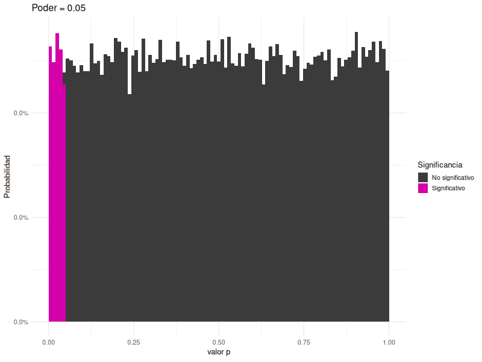

[Ver script de R: distribución de valores p y poder estadístico](https://github.com/JDLeongomez/Presentacion_MetaCiencia/blob/master/r_scripts/distribucion_pvals_poder.R){.is-accent style="font-size: 40%;"}

---

## 1.1 ¿Por qué es tan difícil generar conocimiento confiable? {auto-animate="true"}


[Ver script de R: distribución de valores p y poder estadístico](https://github.com/JDLeongomez/Presentacion_MetaCiencia/blob/master/r_scripts/distribucion_pvals_poder.R){.is-accent style="font-size: 40%;"}

---

## 1.2 ¿Podemos confiar en la literatura? {auto-animate="true"}

**Pregunta:** ¿Qué porcentaje de los hallazgos publicados en psicología son estadísticamente significativos?\

---

## 1.2 ¿Podemos confiar en la literatura? {auto-animate="true"}

**Pregunta:** ¿Qué porcentaje de los hallazgos publicados en psicología son estadísticamente significativos?\
**Respuesta:** [96%]{style="font-size: 150%; color:#d400aa;"}

[[Bakker, Van Dijk y Wicherts (2012)](https://doi.org/10.1177/1745691612459060), [Brzeziński (2023)](https://doi.org/10.31648/przegldpsychologiczny.9680), [Scheel, Schijen y Lakens (2021)](https://doi.org/10.1177/25152459211007467)]{style="font-size: 50%;"}

---

## 1.2 ¿Podemos confiar en la literatura? {auto-animate="true"}

:::: columns
::: {.column .is-accent width="50%"}
::: {.poster}
La psicología necesita cansarse de ganar.

[Haeffel (2022)](https://doi.org/10.1098/rsos.220099){style="font-size: 50%;"}
:::
:::
::: {.column width="50%"}
[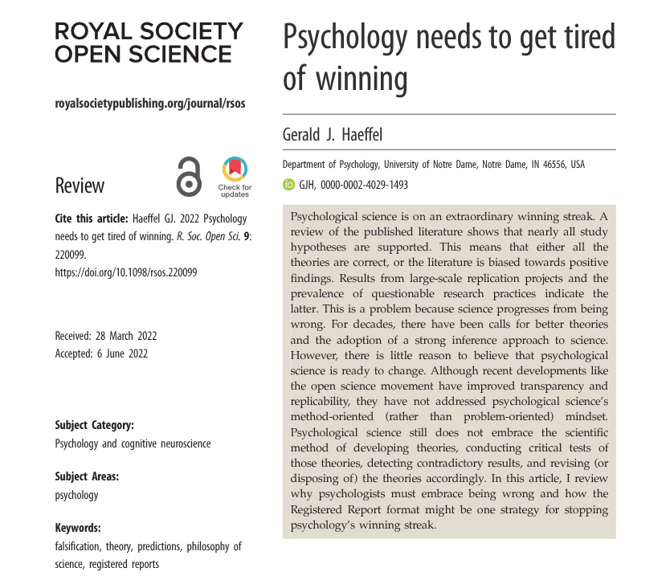{fig-align="center" width="90%"}](https://doi.org/10.1098/rsos.220099)
:::
::::

---

## 1.2 ¿Podemos confiar en la literatura? {auto-animate="true"}

Hay 2 opciones:

::: incremental
1.  Estudiamos efectos con \>90% de poder y \>90% de probabilidad de ser verdaderos.
2.  [Existe un **sesgo de publicación masivo** (en múltiples disciplinas).]{.accent-on-click}
:::

---

## 1.3 El filtro de significancia {auto-animate="true"}

{top="200" left="0" width="80%"}

---

## 1.3 El filtro de significancia {auto-animate="true"}

::::: columns
::: {.column width="50%"}
1.2 millones de valores z investigación médica (1976–2019) {top="200" left="0" width="400"} <br> [[Barnett (2022)](https://medianwatch.netlify.app/post/z_values/), [van Zwet & Cator (2021)](https://doi.org/10.1111/stan.12241)]{style="font-size: 50%;"}
:::

::: {.column .fragment .fade-in width="50%"}
<br><br>También en PLOS ONE <br>
{top="200" right="50" width="400"}  
:::
:::::

---

## 1.4 Amenazas a la replicabilidad científica {auto-animate="true"}

::: incremental
1.  🧪 **P-hacking**
    * Probar múltiples análisis hasta obtener p \< .05
    * Infla el error Tipo I
2.  💡 **HARKing**
    * *Hypothesising After Results are Known* (formular hipótesis tras conocer los resultados)
:::

---

## 1.4 Amenazas a la replicabilidad científica {auto-animate="true"}

💡 [**HARKing**]{.is-accent}


---

## 1.4 Amenazas a la replicabilidad científica {auto-animate="true"}

::: incremental
3.  📦 **Sesgo de publicación**
    * Las revistas prefieren resultados “positivos”
    * Los nulos van al cajón
4.  📏 **Bajo poder estadístico**
    * Muestras pequeñas → falsos negativos y efectos inflados
:::

---

## 1.4 Amenazas a la replicabilidad científica {auto-animate="true"}

Los **cuatro jinetes del apocalipsis de la reproducibilidad**

::: r-stack
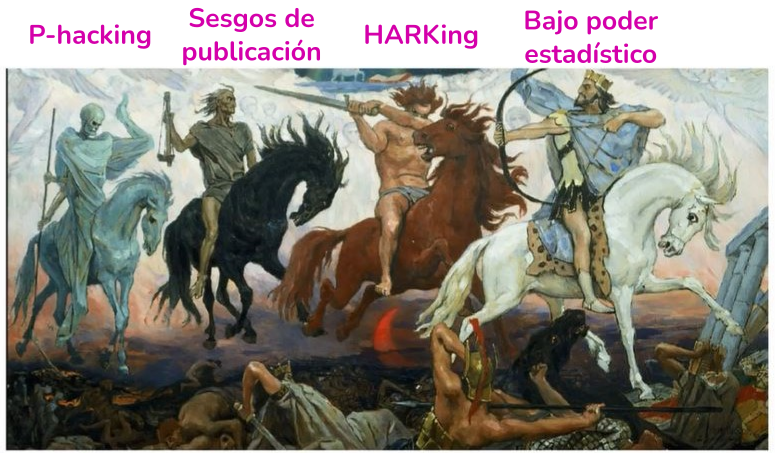{.fragment fig-align="center" width="80%"}
:::

---

##  {auto-animate="true"}

{fig-align="center" width="100%"}

# [Parte 2 · ¿Por qué necesitamos una *Ciencia Abierta*?]{.is-accent auto-animate="true"}

---

## 2.1 Desafíos actuales {auto-animate="true"}

[Acceso desigual al conocimiento y a la producción científica]{.is-accent}

::: r-stack
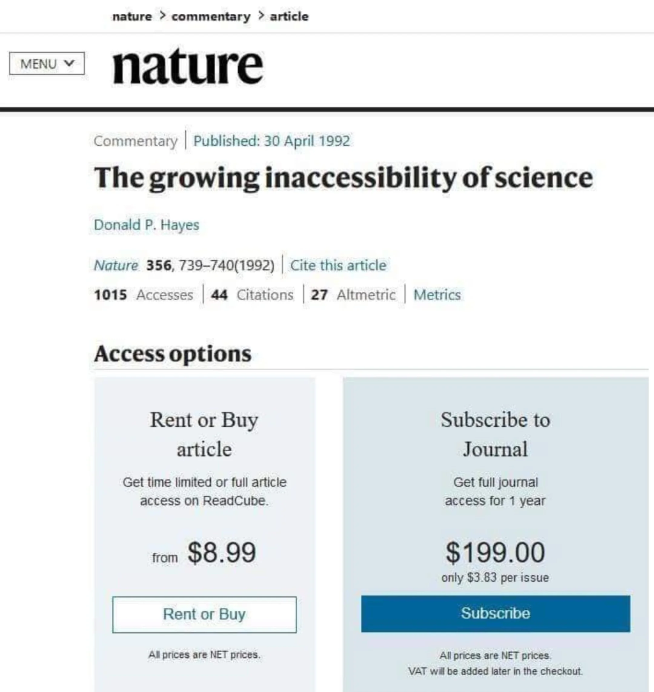{.fragment fig-align="center" width="80%"}
:::

---

## 2.1 Desafíos actuales {auto-animate="true"}

[Acceso desigual al conocimiento y a la producción científica]{.is-accent}

{fig-align="center" width="20%"}

---

## 2.1 Desafíos actuales {auto-animate="true"}

[Acceso desigual al conocimiento y a la producción científica]{.is-accent}

:::::: columns
:::: {.column width="50%"}
::: r-stack
[{width="100%"}](https://doi.org/10.1017/S0140525X0999152X)
:::
::::

::: {.column width="50%"}
**Sociedades:**

[**W**]{.is-accent}estern [(Occidentales)]{style="font-size: 70%; color:#b3b3b3;"}

[**E**]{.is-accent}ducated [(Educadas)]{style="font-size: 70%; color:#b3b3b3;"}

[**I**]{.is-accent}ndustrialised [(Industrializadas)]{style="font-size: 70%; color:#b3b3b3;"}

[**R**]{.is-accent}ich [(Ricas)]{style="font-size: 70%; color:#b3b3b3;"}

[**D**]{.is-accent}emocratic [(Democráticas)]{style="font-size: 70%; color:#b3b3b3;"}

[[Henrich et al. (2010)](https://doi.org/10.1017/S0140525X0999152X)]{style="font-size: 50%;"}
:::
::::::

---

## 2.1 Desafíos actuales {auto-animate="true"}

[Acceso desigual al conocimiento y a la producción científica]{.is-accent}

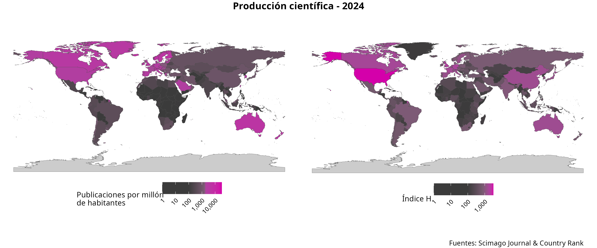{fig-align="center" width="100%"}

[Ver script de R: maps de producción científica 2024](https://github.com/JDLeongomez/Presentacion_MetaCiencia/blob/master/r_scripts/mapas_produccion_cientifica_2024.R){.is-accent style="font-size: 40%;"}

---

## 2.1 Desafíos actuales {auto-animate="true"}

> [¿Qué espera y qué requiere la sociedad de la ciencia? ¿Qué estamos entregando?]{.is-accent style="font-size: 150%;"}

# [Parte 3 · Soluciones desde la *Ciencia Abierta*]{.is-accent auto-animate="true"}

---

## 3.1 Más allá del Open Access {auto-animate="true"}

::: incremental
-   **Open Access** (con matices: gold/green/diamond, costos, *waivers*)\
-   **Open Data** (datos FAIR, reutilización responsable)\
-   **Open Methods** (protocolos, metadatos, decisiones analíticas)\
-   **Open Source** (software libre, entornos reproducibles)\
-   **Open Peer Review** (mayor escrutinio, trazabilidad)\
-   **Open Resources** (formación y materiales abiertos)
:::

---

## 3.1 Más allá del Open Access {auto-animate="true"}

> [Debemos abrir el *proceso* científico, no solo los PDFs.]{.is-accent style="font-size: 150%;"}

::: r-stack
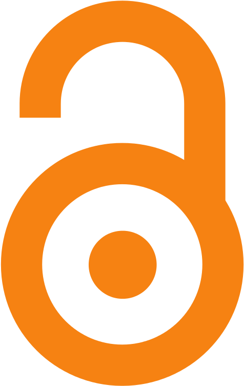{.fragment fig-align="center" width="20%"}

{.fragment fig-align="center" width="20%"}
:::

---

## 3.2 Reportes Registrados (Registered Reports - RRs) {auto-animate="true"}

**Efectos**

::::: columns
::: {.column .fragment .fade-in width="50%"}
Ciencias biomédicas\
[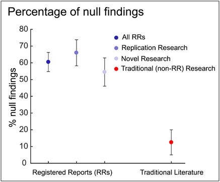{top="200" right="50" height="300"}](https://doi.org/10.1371/journal.pbio.3000246) <br> [Allen & Mehler (2019)](https://doi.org/10.1371/journal.pbio.3000246){style="font-size: 50%;"}
:::

::: {.column .fragment .fade-in width="50%"}
Psicología\
[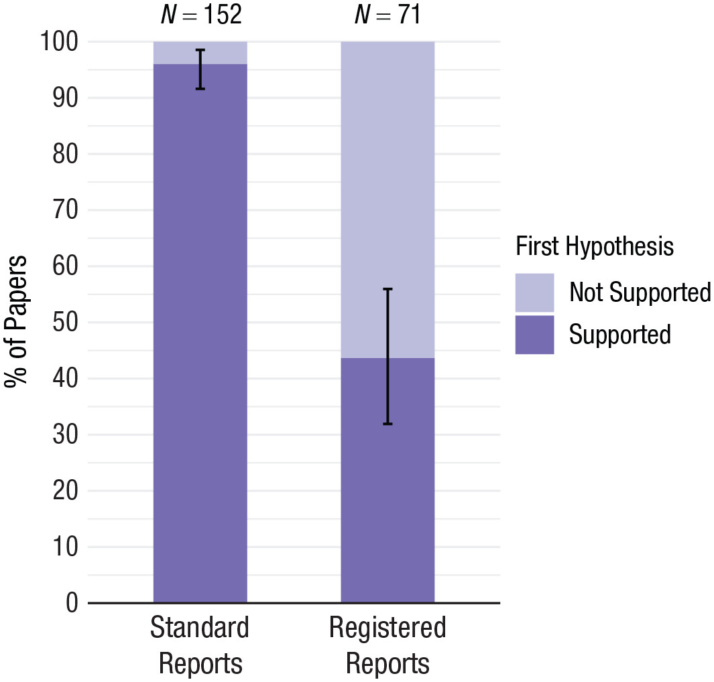{top="200" left="0" height="300"}](https://doi.org/10.1177/25152459211007467) <br> 
[[Scheel et al (2021)](https://doi.org/10.1177/25152459211007467)]{style="font-size: 50%;"}
:::
:::::


# [Parte 4 · De la teoría a la acción: Semillero *MetaCiencia*]{.is-accent auto-animate="true"}

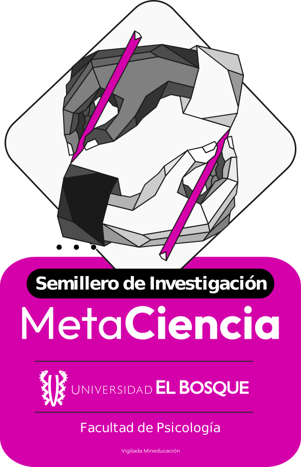{fig-align="center" width="40%"}

---

## 4.1 Objetivos {auto-animate="true"}

:::: columns
::: {.column width="50%"}
> **Objetivo general:** transformar prácticas científicas desde etapas tempranas de formación universitaria.
:::

::: {.column width="50%" .incremental style="font-size:60%; line-height:1.25;"}
1. Fomentar **green OA**, apertura de datos y documentación de procesos.
2. Desarrollar **productos y estrategias de divulgación** y repositorios abiertos.
4. Articular saberes (psicología, medicina, ciencias, diseño, etc.).
5. Promover liderazgo estudiantil y cultura científica colaborativa.
:::
::::

---

## 4.2 ¿Quiénes pueden participar? {auto-animate="true"}

::: {.incremental style="line-height:1.25;"}
- 🎓 **Estudiantes** (énfasis en pregrado) y profesionales de todas las áreas
- 🌱 **No se requiere experiencia previa** en investigación
- 🔎 **Intereses**:\
  [🧪 Ciencia]{.chip} [🧠 Filosofía]{.chip} [📊 Estadística]{.chip} [💻 Programación]{.chip}
  [📣 Comunicación y divulgación]{.chip} [🤝🏫 Colaboración con estudiantes de otras carreras y universidades]{.chip}
:::

---

## ¿Te interesa unirte a MetaCiencia? {auto-animate="true"}

Escanea el código QR y deja tus datos para recibir más información sobre el semillero.

[{fig-align="center" width="40%"}](https://forms.office.com/r/k3wp85Tcdq)

---

## ¡Gracias! {auto-animate="true" autoslide="1000"}

{fig-align="center" width="80%"}

---

## ¡Gracias! {auto-animate="true"}

::::: columns
::: {.column width="45%"}
[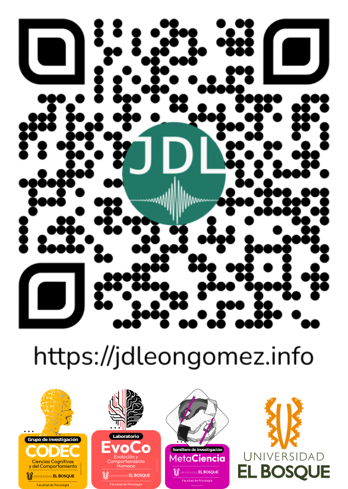{width="80%"}](https://jdleongomez.info/es/)
:::

::: {.column width="55%"}
**Juan David Leongómez** [PhD, MSc]{style="font-size: 50%;"}<br> [[jleongomez\@unbosque.edu.co](mailto:jleongomez@unbosque.edu.co)]{style="font-size: 70%;"}<br>
{fig-align="right" width="55%"}
:::
:::::